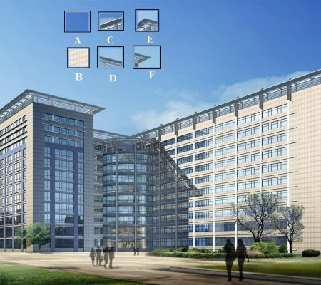
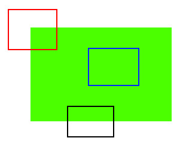

# Entendendo as Características (Features)

O objetivo é entender o que são características em imagens, por que são importantes, e como podemos identificá-las, principalmente focando nos cantos e padrões únicos presentes nas imagens.

## Explicação

A maioria de nós já jogou jogos de quebra-cabeça. Nesse tipo de jogo, você recebe várias peças pequenas de uma imagem e precisa montá-las corretamente para formar uma grande imagem. A questão é como fazemos isso? E se projetássemos essa teoria para um programa de computador, para que ele pudesse jogar quebra-cabeça?
Uma pergunta central é: **como podemos organizar muitas peças de imagem embaralhadas para formar uma grande imagem única?**

A resposta está na busca por padrões ou características específicas nas imagens que sejam únicas, fáceis de rastrear e fáceis de comparar.
Portanto, **as características são pontos ou padrões em uma imagem que são fáceis de identificar, comparar e rastrear.** Em um jogo de quebra-cabeça, por exemplo, encontramos as peças de uma imagem buscando padrões únicos, como cantos e bordas, isto é, lá o objetivo é observar a continuidade entre as diferentes imagens, o que são habilidades naturais para seres humanos. 
Sendo assim, o computador também precisa buscar padrões únicos para tentar juntar imagens ou construir modelos 3D.

Dessa forma, nossa pergunta se expande para mais questões: **Quais são essas características únicas, fáceis de rastrear e fáceis de comparar?** 
Vamos analisar a imagem abaixo para responder essa pergunta: 

Na imagem, temos seis pequenas partes da imagem original e precisamos identificar a localização exata delas. Algumas dessas partes são mais fáceis de localizar, outras mais difíceis.

- **A e B** representam áreas planas que se espalham por uma grande área, tornando-as difíceis de localizar com precisão, pois não apresentam variação de padrão.
- **C e D** são bordas do prédio. Embora seja possível encontrar uma localização aproximada, a localização exata ainda é difícil, já que o padrão é repetido ao longo da borda.
- **E e F** são cantos do prédio. Como nos cantos, qualquer variação na posição da peça leva a uma mudança visível, isso os torna boas características para comparação. 

Agora, vejamos uma imagem mais simples:

- A **parte azul** é uma área plana, difícil de localizar, pois qualquer movimentação faz com que a aparência da região permaneça a mesma.
- A **parte preta** tem uma borda. Se movida ao longo do gradiente (vertical), a borda muda, mas se movida paralelamente à borda, a aparência permanece a mesma.
- A **parte vermelha** representa um canto. Onde quer que você mova essa parte, ela parecerá diferente, o que a torna **única**. Portanto, cantos são considerados boas características em uma imagem.

### Tipos de Características
Portanto: 
- **Áreas Planas**: Difíceis de detectar, pois a aparência não muda com o movimento.
- **Bordas**: Mais fáceis de localizar, mas com desafios devido à repetição de padrões.
- **Cantos**: São as melhores características, pois mudam visivelmente com qualquer movimento, tornando-as fáceis de identificar.

### Como Encontramos as Características?
Agora que sabemos o que são essas características, surge a próxima pergunta: **Como as encontramos?**  
Procuramos regiões da imagem que tenham a maior variação quando movidas. Este processo é chamado de **Feature Detection (Detecção de Características)**. 
Uma vez encontradas as características, o próximo passo é poder encontrá-las em outras imagens. Dessa forma, para fazer isso, descrevemos essas características com palavras, como "a parte superior é céu azul", para encontrá-las em outras imagens. Esse processo é conhecido como **Feature Description (Descrição de Características)**.

Uma vez encontradas as características, o próximo passo é poder encontrá-las em outras imagens. Como fazemos isso? Podemos pegar uma região ao redor da característica e descrevê-la com palavras, como "a parte superior é céu azul, a parte inferior é um prédio com vidro, etc.", e procurar essa mesma área nas outras imagens. Um computador também pode descrever a região ao redor de uma característica para poder encontrá-la em outras imagens. Esse processo de descrever a característica é chamado de **Descrição de Características**.

Com essas descrições, podemos alinhar e combinar as imagens ou criar um modelo 3D.

## Conclusão
Veremos diferentes algoritmos do OpenCV para detectar, descrever e corresponder características nas imagens.

Fonte: https://docs.opencv.org/3.4/db/d27/tutorial_py_table_of_contents_feature2d.html

## Questões
**1) O que é uma característica (ou ponto chave)**
As características são padrões em uma imagem que são únicos, fáceis de identificar, comparar e rastrear. 

**2) Quais são essas características únicas, fáceis de rastrear e fáceis de comparar? Por que os cantos são importantes** 
São aquelas que mudam visualmente com qualquer movimento, como os cantos, pois onde quer que movemos essa parte, ela parecerá diferente, o que a torna única. 
