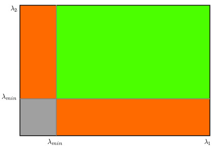
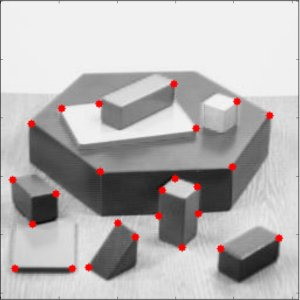

# Detector de Cantos Shi-Tomasi & Boas Características para Rastrear

## Objetivo 

- Vamos aprender sobre outro detector de cantos: o Detector de Cantos Shi-Tomasi.
- Vamos ver a função: `cv.goodFeaturesToTrack()`.

## Teoria

Mais tarde, em 1994, J. Shi e C.Tomasi fizeram uma pequena modificação no Detector de Cantos Harris. 
Lembrando, a função de pontuação no Harris Corner Detection é dada por: 

$$
R = \lambda_1 \lambda_2 - k(\lambda_1 + \lambda_2)^2
$$

Em vez disso, Shi-Tomasi propôs: 

$$
R = \min(\lambda_1, \lambda_2)
$$

Basicamente, Shi-Tomasi só considera canto se o menor autovalor também for grande
Se o resultad R for maior que um valor de limiar, é considerado um canto. Se plotarmos $\lambda_1 - \lambda_2$, teremos: 



A partir do ponto mín, é considerado um canto. 

## Código
O OpenCV possui a função `cv.goodFeaturesToTrack().` Ela encontra os N cantos mais fortes na imagem usando o método Shi-Tomasi.
Nessa função, vamos especificar, além da imagem: 
- Número de cantos que desejamos encontrar.
- Qualidade (valor entre 0 e 1), que representa a qualidade mínima da qual todos que estiverem abaixo serão rejeitados. 
- Distância euclidiana mínima entre os cantos detectados. 

Com todas essas informações, a função encontra os cantos na imagem. Todos os cantos abaixo do nível de qualidade são rejeitados. Sendo assim, ela classifica os cantos restantes com base na qualidade, em ordem decrescente. Depois, a função pega o primeiro canto mais forte, descarta todos os cantos próximos no intervalo da distância mínima e retorna os N cantos mais fortes.

**Exemplo:** Vamos encotnrar os 25 melhores cantos: 

```python
import numpy as np
import cv2 as cv
from matplotlib import pyplot as plt

# Lendo a imagem e colocando em escala cinza
img = cv.imread('blox.jpg')
gray = cv.cvtColor(img, cv.COLOR_BGR2GRAY)

# Detectando os cantos
corners = cv.goodFeaturesToTrack(gray, 25, 0.01, 10)
# Transformando em inteiros
corners = np.int0(corners)

for i in corners:
    x, y = i.ravel()
    cv.circle(img, (x, y), 3, 255, -1)

plt.imshow(img)
plt.show()
```

**OBS:** O 0.01 representa: 
$$
\lambda_{\min} > 0.01 \cdot \lambda_{\max}
$$

