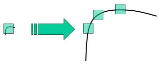
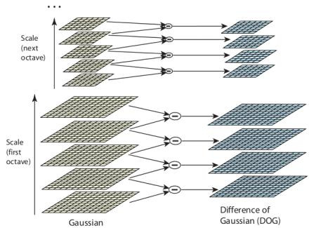
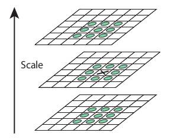

# Introdução ao SIFT (Scale-Invariant Feature Transform)

## Objetivos 
- Vamos aprender os conceitos do algoritmo SIFT.
- Vamos aprender a encontrar keypoints e descritores SIFT.

## Teoria
Os dois últimos detectores de cantos, como Harris, são invariantes à rotação, isto é, mesmo que a imagem seja rotacionada, conseguimos encontrar os mesmo cantos, até porque cantos não deixam de ser cantos. 
Contudo, isso não acontece com a escala, pois um canto pode deixar de ser um canto se a imagem for redimensionada, por exemplo, um canto em uma imagem pequena pode parecer uma região plana quando ampliado na mesma janela, e isso faz o detector Harris não identificar o canto. 



Nesse sentido, em 2004, D. Lowe propôs o algoritmo SIFT, que resolve o problema de detectar a mesma feature mesmo se a imagem estiver maior ou menor. 
Por exemplo: 
- Drone longe = objeto pequeno
- Drone perto = Objeto grande

Dessa forma, se usarmos a mesma janela fixa, será um sistema falho. 

### Etapas do SIFT 
**1) Detecção de Extremos no Espaço de Escala**

Essa etapa gira em torno de detectar manchas (blobs), porém não podemos usar a mesma janela para detectar características em diferentes escalas. Sendo assim, utiliza-se o **scale-space filtering:**
A ideia é que aqui, ao invés de mudarmos o tamanho da janela, mudamos o tamanho da imagem. 
- Aplica-se o operador Laplacian of Gaussian (LoG) com vários valores de σ
- O σ funciona como parâmetro de escala
- Detecta blobs em diferentes tamanhos

Exemplo:
- σ pequeno: detecta detalhes pequenos
- σ grande: detecta estruturas maiores

Como LoG é custoso, o SIFT usa uma aproximação: Difference of Gaussians (DoG)
- Subtração de duas imagens suavizadas com σ e kσ
- Construção de uma pirâmide Gaussiana

Basicamente estamos detecando onde a imagem muda mais entre as escalas. 

Depois disso, cada pixel é comparado com seus vizinhos, isto é, 8 vizinhos na mesma escoala, 9 na escala acima e 9 na escala abaixo. Dentre esses, se for máximo ou mínimo local, esse pixel é um keypoint candidato. 

---

**Vamos tentar explicar esse processo melhor:**
Nesta etapa de detecção de extremos, o algoritmo pega a imagem e aplica vários níveis de blur (σ) dentro de uma mesma octave. 
Esse Blur tira detalhes pequenos suavizando a imagem, enquanto a octave é uma escala da imagem. 
Em vez de usar LoG diretamente, como ficaria pesado computacionalmente, utiliza DoG, que é a diferença entre imagens suavizadas com blurs diferentes. Isso gera várias imagens DoG dentro da mesma octave (mesma resolução).
Esse processo é repetido para outras octaves (imagem reduzida). 
Em seguida, cada pixel é comparado com seus 26 vizinhos (Vamos pensar em um cubo mágico 3x3, o centro dele não é visto, mas em volta dele, tem 26 vizinhos, sendo 8 laterais, 9 em cima e 9 em baixo). 
Se a intensidade da mancha desse pixel analisado com os 26 vizinhos for máxima ou mínima entre eles, temos um keypoint candidato. 

**ATENÇÃO:** Aqui não estamos mais detectando cantos, estamos detectando keypoints, que ainda são características únicas, mas de outra forma, pois é um ponto distinto e mais estável em escala

Uma segunda observação importante é que quando mudamos o blur estamos suavizando a imagem, mas a escala em si é a mesma, isto é, não muda a resolução. Porém, quando mudamos de OCTAVE, estamos **reduzindo pela metade** o tamanho da imagem, ou seja, muda a resolução. 
Dentro da octave estaremos simulando o zoom com o blur, por isso vários níveis de zoom, já entre octaves, estamos realmente mudando o tamanho da imagem.
- Aumentar o blur σ = desfocar visão/zoom
- Aumentar a octave = subir o drone

**Cuidado também:** Uma escala maior, temos menos detalhes finos, então a resolução é menor (como 256 x 256). Já uma escala menor, temos mais detalhes finos, então a resolução é maior (como 512 x 512). Por isso, ao aumentarmos a escala de uma octave para outra, estamos reduzindo a imagem pela metade, ou seja, a resolução cai pela metade, e então vários pixels se transformam em um único mais grosso. 

---
DoG:



Comparação:



Cada keypoint possui uma coordenada (x, y, blur(sigma))

**2) Localização dos Keypoints**
Depois que temos os candidatos a keypoint, esses dados ainda são brutos, ou seja, muitos deles não são precisos, têm pouco contrate ou estão em bordas (instáveis). 
Dessa forma, o SIFT usa uma expansão de Taylor da função DoG ao redor do ponto para estimar melhor onde está o extremo real, ou seja, na prática ele ajusta levemente a posição (x, y, sigma) e pode chegar em coordenadas subpixel. 

Além disso, é feito:
- Remove pontos com baixo contraste (threshold ≈ 0.03) `contrastThreshold` no OpenCV

- Remoção de bordas:

    - Usa matriz Hessiana (2x2)
    Se razão dos autovalores for alta, é considerado borda, então ele descarta (edgeThreshold aproximadamente 10)

Como resultado, ficam apenas pontos fortes e estáveis.

**3) Atribuição de Orientação**
Aqui é calculado a magnitude e o ângulo dos keypoints, e isso definirá alguma orientação que o ponto tem. 

**4) Descritor do Keypoint**
A ideia é criar a descrição do ponto, isto é, criar uma assinatura, como se fosse uma impressão digital, do que está ao redor do ponto. Essa assinatura é o descritor. 
**Como faz essa descrição?**
Para fazer isso, o algoritmo seleciona uma região ao redor do ponto chave, por exemplo 16x16 pixels (sempre proporcional ao blur em questão), e a imagem já está alinhada com a direção do keypoint. 
A partir dessa região 16x16, é dividida em regiões menores, como 4x4, o que nos retorna um total de 16 regiões menores. Para cada bloco (4x4), é calculado o gradiente, e cria-se um histograma com 8 direções. 
Cada pixel vota com seu ângulo e peso (magnitude). A partir disso, como temos 16 blocos e cada bloco nos da 8 direções, ao todo temos 128 valores. Portanto, o nosso **descritor é um vetor de 128 dimensões**

---

Vamos fazer uma sequência de passos para entender a orientação e a descrição: 
- Temos o keypoint em (x, y, sigma)
- Pegaremos uma região ao redor dele (16x16 pixels)
- Para cada pixel dessa região, faremos: 
$$
I_x = I(x+1, y) - I(x-1, y)
$$

$$
I_y = I(x, y+1) - I(x, y-1)
$$

Lembrando que a derivada ta sendo feita pela diferença. 

Com isso, temos o vetor gradiente. 
- Com o gradiente, conseguimos encontrar o ângulo desse vetor e a intensidade, para CADA pixels. 
- Após calcular o gradiente de cada pixel da região 16x16, temos tanto a magnitude quanto o ângulo. 
- Para definir a orientação do keypoint, construímos um histograma de direções usando todos os pixels da região:
- Dividimos o círculo (360°) em bins (por exemplo, 36 bins de 10° cada)
Cada pixel vota no histograma com:
    - sua direção (ângulo)
    - peso = sua magnitude

- A direção com maior valor acumulado no histograma é a orientação dominante do keypoint

**Exemplo:**
```text
Pixel A → magnitude = 100, ângulo = 30°
Pixel B → magnitude = 80,  ângulo = 31°
Pixel C → magnitude = 70,  ângulo = 35°
Pixel D → magnitude = 60,  ângulo = 32°
Pixel E → magnitude = 50,  ângulo = 120°
```
Nesse caso, o binário no vetor que representa o 30° recebe os pesos somados de todos os ângulos que estão mais próximos de 30° 
100 + 80 + 70 + 60 = 310
E o Bin 120° recebe 50. 
Portanto, ângulo do keypoint é 30°.

- Essa orientação será usada para alinhar a região, tornando o descritor invariante à rotação

- Alinhamos a região de 16x16 ao redor do keypoint (para se tornar invariante na rotação), o que indica que pegaremos os angulos de cada pixel e atribuiremos um novo angulo para eles com relação ao keypoint (angulo_novo = angulo_antigo - ângulo do keypoint).
- Pegamos a mesma região 16×16 ao redor do keypoint e já alinhada e dividimos a região em 4x4 blocos 
- Para cada bloco (4×4 pixels):
    - Calculamos um histograma de direções com 8 bins:
[0°,45°,90°,135°,180°,225°,270°,315°]
- Cada pixel do bloco vota novamnete com:
    - seu ângulo (novo)
    - peso = magnitude (a magnitude é a mesma)
- Cada bloco vai gerar um vetor de 8 valores [h1, h2, h3, ..., h8], sendo os pesos dos votos de cada pixel com relação ao ângulo. 
- Concatena o vetor de cada bloco em um único vetor grande, o resultado é o descritor. 

---

**5) Matching de Keypoints**
Depois de extrair os keypoints e seus descritores (vetores de 128 dimensões), o objetivo é encontrar quais pontos de uma imagem correspondem aos pontos da outra. 
Para cada keypoint da imagem A:
- pegamos seu descritor
- comparamos com todos os descritores da imagem B
- Usamos uma medida de distância, normalmente a distância euclidiana
- quanto menor a distância mais parecidos os descritores

Pode ser que um descritor da imagem A seja muito parecido com vários da imagem B, por exemplo, estruturas iguais, como várias janelas iguais em um prédio. 

Para resolver isso, utiliza-se **Ratio Test (Lowe)**
- Pega a distância do melhor match
- Pega a distância do segundo melhor match
- (dist1 / dist 2) < 0.8

Basicamente, isso indica que se o melhor match é muito melhor, então ele é confiável e aceita, se não é ambíguo e descarta (se o valor for maior ou igual a 0.8).

## Codigo
```python
import numpy as np
import cv2 as cv

# Leitura e preparação da imagem
img = cv.imread('home.jpg')
gray = cv.cvtColor(img, cv.COLOR_BGR2GRAY)

# criação do detector SIFT
sift = cv.SIFT_create() # é um objeto
# Detectando keypoints (pirâmide de escala DoG, detecção de extremos
# e filtragem)
kp = sift.detect(gray, None)
# Resultado é uma lista de kp

# Desenhando os keypoints na imagem
img = cv.drawKeypoints(gray, kp, img)
cv.imwrite('sift_keypoints.jpg', img)

# Desenhando de uma forma mais rica
img = cv.drawKeypoints(gray, kp, img,
                      flags=cv.DRAW_MATCHES_FLAGS_DRAW_RICH_KEYPOINTS)

# Calculando descritores
kp, des = sift.compute(gray, kp)
```

```python
# Ao invés de usar kp = detect e kp, des = shift...
# Fazer esses dois comandos em uma linha
kp, des = sift.detectAndCompute(gray, None)
```

Lembrando que cada keypoint vai ter uma posição (x, y), uma escala (blur), uma orientação (ângulo de acordo com o vetor gradiente) e a resposta.