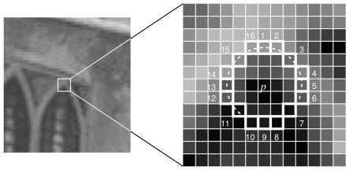

# Algoritmo FAST para Detecção de Cantos

## Objetivo
- Vamos entender os conceitos básicos do algoritmo FAST
- Vamos encontrar cantos usando as funcionalidades do OpenCV para o FAST

## Teoria
Esse é um algoritmo mais rápido para detecção de cantos proposto por Edward Rosten e Tom Drummond em 2006 (revisado em 2010).

### Detecção de Características usando FAST
1 - Escolha um pixel $p$ na imagem que será testado como ponto de interesse. Sua intensidade é $I_p$.
2 - Escolha um valor de limiar $t$.
3 - Considere um círculo de 16 pixels ao redor de $p$.
4 - O pixel $p$ é considerado um canto se existir um conjunto de $n$ pixels consecutivos nesse círculo (de 16 pixels) que sejam:
- todos mais claros que $I_p + t$, ou  
- todos mais escuros que $I_p - t$.

OBS: Normalmente n = 12



---

**Teste de alta velocidade (teste rápido - high-speed test)**

Para acelerar o processo:

- São testados apenas 4 pixels do círculo: posições 1, 9, 5 e 13
- Primeiro testa 1 e 9
- Se passar, testa 5 e 13

Se pelo menos 3 desses 4 pixels satisfazem a condição:
- pode ser um canto, então faz o teste completo

Caso contrário:
- descarta imediatamente

---

### Problemas do método FAST original
- Não elimina bem candidatos quando n < 12
- Escolha dos pixels não é ótima
- Resultados do teste rápido são descartados
- Detecta múltiplos pontos muito próximos

### Machine learning no FAST
Para tentar resolver os problemas encontrados: 
1 - Seleciona imagens de treinamento.
2 - Executa FAST e coleta os 16 pixels ao redor de cada ponto.
3 - Cada pixel pode estar em 3 estados:
- mais claro  
- mais escuro  
- similar  

4 - Cria um vetor de características $\mathbf{P}$.
5 - Define a variável booleana $K_p$:
- verdadeiro: é canto  
- falso: não é  

6 - Usa o algoritmo ID3 (árvore de decisão) para aprender:
- quais pixels são mais informativos  

7 - Constrói uma árvore de decisão para detecção rápida.

Após isso, usa-se a árvore para decidir se é canto ou não. 

### Supressão de Não-Máximos
O Non-maximal Suppression resolve o problema de muitos pontos próximos terem sido detectados. 

1 - Calcula uma pontuação $V$:
$$
V = \sum \left| I_p - I_{\text{vizinhos}} \right|
$$

2 - Para pontos próximos:
- mantém o de maior $V$  
- descarta o outro

Por exemplo: 
```text
Antes do V:
. . X .
. X X X
. . X .

Depois do V:
. . . .
. . X .
. . . .
```
Só o melhor fica. 

### FAST no OpenCV
Pode ser usado como qualquer detector:

Parâmetros:
- threshold
- supressão de não-máximos
- tipo de vizinhança

Tipos disponíveis:
`cv.FAST_FEATURE_DETECTOR_TYPE_5_8`
`cv.FAST_FEATURE_DETECTOR_TYPE_7_12`
`cv.FAST_FEATURE_DETECTOR_TYPE_9_16`

## Código: 
```python
import numpy as np
import cv2 as cv
from matplotlib import pyplot as plt

# Leitura da imagem em escala cinza
img = cv.imread('blox.jpg', cv.IMREAD_GRAYSCALE)

# Criar detector FAST
fast = cv.FastFeatureDetector_create()

# Detectar pontos
kp = fast.detect(img, None)

# Desenhar
img2 = cv.drawKeypoints(img, kp, None, color=(255,0,0))

# Ver parâmetros
# Quão diferente o pixel central precisa ser dos vizinhos
print("Threshold:", fast.getThreshold())
# Se ativa a Non-maximum suppression
print("nonmaxSuppression:", fast.getNonmaxSuppression())
# Tipo de FAST usado (tamanho do círculo: 9, 12, 16 pixels)
print("neighborhood:", fast.getType())
# Pontos detectados
print("Total com supressão:", len(kp))

cv.imwrite('fast_true.png', img2)

# Desativar supressão
fast.setNonmaxSuppression(0)
kp = fast.detect(img, None)

print("Total sem supressão:", len(kp))

# Desenhar 
img3 = cv.drawKeypoints(img, kp, None, color=(255,0,0))
cv.imwrite('fast_false.png', img3)
```