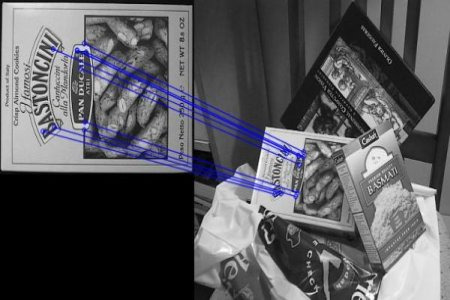
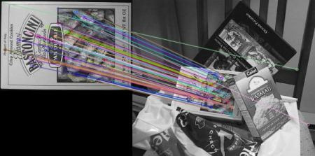
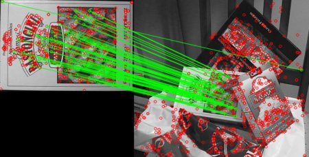

# Correspondência de Características (Feature Matching)

## Objetivo 
- Vamos ver como fazer a correspondência de características entre imagens
- Vamos usar o Brute-Force Matcher e o FLANN Matcher no OpenCV

## Teoria e Código

### Brute-Force Matcher
Para cada descritor da primeira imagem, o Brute-Force Matcher:
- Compara com todos os descritores da segunda imagem
- Calcula a distância 
- Retorna o mais próximo

#### Criando o BFMatcher
```python
bf = cv.BFMatcher()
```

#### Parâmetros
**1. normType (tipo de distância)**
`cv.NORM_L2: SIFT, SURF`
`cv.NORM_L1: alternativa`
`cv.NORM_HAMMING: ORB, BRIEF, BRISK`
`cv.NORM_HAMMING2: ORB com WTA_K = 3 ou 4`

**2. crossCheck**
`False (default)`
`True: só aceita matches consistentes`

-  Match válido:

    - A -> B é melhor
    - B -> A também é melhor


#### Métodos principais
`match()`: melhor match
`knnMatch(k)`: k melhores matches

#### Visualização
`cv.drawMatches()`: desenha matches
`cv.drawMatchesKnn()`: desenha k matches

#### Exemplo

---

**Exemplo com ORB**
```python
import numpy as np
import cv2 as cv
import matplotlib.pyplot as plt

img1 = cv.imread('box.png', cv.IMREAD_GRAYSCALE)
img2 = cv.imread('box_in_scene.png', cv.IMREAD_GRAYSCALE)

# Inicializa o ORB detector
orb = cv.ORB_create()

# Encontra e descreve os keypoints 
kp1, des1 = orb.detectAndCompute(img1, None)
kp2, des2 = orb.detectAndCompute(img2, None)
```

**Matching**
```python
# Cria o objeto BFMatcher
bf = cv.BFMatcher(cv.NORM_HAMMING, crossCheck=True)

# Match descriptors
matches = bf.match(des1, des2)

# Ordena por distância
matches = sorted(matches, key=lambda x: x.distance)

# Desenha os 10 primeiros matches
img3 = cv.drawMatches(img1, kp1, img2, kp2,
                      matches[:10], None,
                      flags=cv.DrawMatchesFlags_NOT_DRAW_SINGLE_POINTS)

plt.imshow(img3), plt.show()
```



Cada match tem: 
- distance: quanto menor, melhor
- trainIdx: índice na imagem destino
- queryIdx: índice na imagem origem
- imgIdx: índice da imagem

---

**Exemplo com SIFT + Ratio Test**
```python
import numpy as np
import cv2 as cv
import matplotlib.pyplot as plt

# Inicializa o SIFT detector
sift = cv.SIFT_create()

# Encontra e descreve com SIFT 
kp1, des1 = sift.detectAndCompute(img1, None)
kp2, des2 = sift.detectAndCompute(img2, None)

# Inicializa o BFMatcher com os parametros default.
bf = cv.BFMatcher()

# Faz o match
matches = bf.knnMatch(des1, des2, k=2)

# Aplica Ratio Test (remove matches ruins)
good = []
for m, n in matches:
    if m.distance < 0.75 * n.distance:
        good.append([m])

# Desenha
img3 = cv.drawMatchesKnn(img1, kp1, img2, kp2,
                         good, None,
                         flags=cv.DrawMatchesFlags_NOT_DRAW_SINGLE_POINTS)

plt.imshow(img3), plt.show()
```




### FLANN Matcher (Fast Library for Aprproximate Nearest Neighbors)
Esse é mais rápido para grandes datasets e com descritores de alta dimensão. 

#### Criando FLANN Matcher
```python
flann = cv.FlannBasedMatcher(index_params, search_params)
```

#### Parâmetros 
**Para SIFT/SURF:**
```python
FLANN_INDEX_KDTREE = 1
index_params = dict(algorithm=FLANN_INDEX_KDTREE, trees=5)
```

**Para ORB:**
```python
FLANN_INDEX_LSH = 6
index_params = dict(
    algorithm=FLANN_INDEX_LSH,
    table_number=6,
    key_size=12,
    multi_probe_level=1
)
```

**Search Params:**
```python
search_params = dict(checks=50)
```
Quanto mais checks, mais preciso, e quanto menos checks, mais rápido. 

#### Exemplo

---

**Exemplo com FLANN:**
```python
import numpy as np
import cv2 as cv
import matplotlib.pyplot as plt

# Criando o SIFT
sift = cv.SIFT_create()

# Detectando e descrevendo keypoints
kp1, des1 = sift.detectAndCompute(img1, None)
kp2, des2 = sift.detectAndCompute(img2, None)

# Parâmetros do FLANN (vamos usar o SIFT)
FLANN_INDEX_KDTREE = 1
index_params = dict(algorithm=FLANN_INDEX_KDTREE, trees=5)
search_params = dict(checks=50)

# Criando o FLANN
flann = cv.FlannBasedMatcher(index_params, search_params)

matches = flann.knnMatch(des1, des2, k=2)

# É importante desenhar apenas com matches válidos,
# por isso vamos criar uma máscara
matchesMask = [[0,0] for i in range(len(matches))]

# Ratio Test
for i, (m, n) in enumerate(matches):
    if m.distance < 0.7 * n.distance:
        matchesMask[i] = [1,0]

# Desenhando
draw_params = dict(
    matchColor=(0,255,0),
    singlePointColor=(255,0,0),
    matchesMask=matchesMask,
    flags=cv.DrawMatchesFlags_DEFAULT
)

img3 = cv.drawMatchesKnn(img1, kp1, img2, kp2,
                         matches, None, **draw_params)

plt.imshow(img3), plt.show()
```



---

Perceba que o FLANN é mais rápido porque faz uma busca aproximada, mas o BFMatcher, como é força bruta, terá um melhor resultado. 

#### Fonte 
Link: https://docs.opencv.org/3.4/dc/dc3/tutorial_py_matcher.html