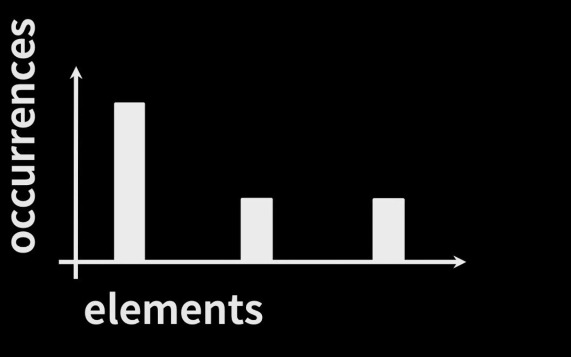
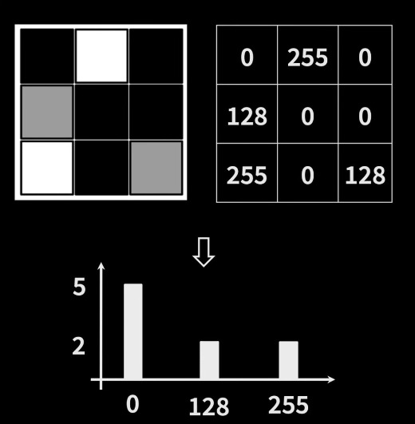

# Histogramas de imagem

Vamos entender o que é e por que são úteis.  

Primeiro, o que é um hitograma?
Um histograma de imagem mostra a frequência com que diferentes valores de intensidade ocorrem em uma imagem. 
Por exemplo, ele nos diz com que frequência a cor preta ocorre e com que frequência a cor branca ocorre na imagem. 
Exemplo de histograma: 

Vamos ver um exemplo de histograma com imagens:

Perceba que temos 9 pixels ao total, e três cores diferentes. 

Com o histograma, conseguimos aplicar funções para modificar imagens. 

Também temos a equalização de histograma, que consiste em distribuir os diferentes valores de intensidade em um histograma, considerando os valores de cor individuais. O objetivo é transformar a imagem resultante em uma imagem com histograma que distribua os valores de cor igualmente por toda a gama de intensidades possíveis, o que resulta em imagens com maior contraste. 

#### Fonte:
Link: https://www.youtube.com/watch?v=flI_Umo_VAU&list=PLgnQpQtFTOGRYjqjdZxTEQPZuFHQa7O7Y&index=4