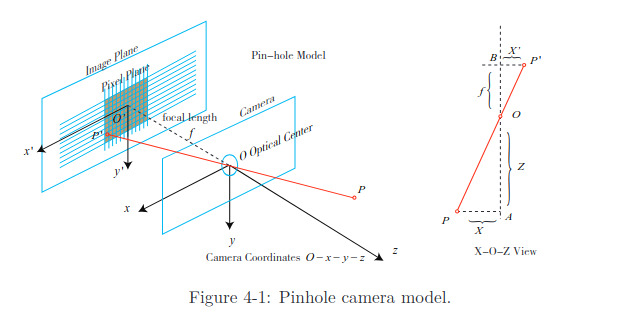

# Modelos de Câmera Pinhole

O processo de projetar um ponto 3D (em metros) em um plano de imagem 2D (em pixels) pode ser descrito por um modelo geométrico, que, nesse caso, será o modelo pinhole. 
Ao mesmo tempo, devido à presença de lentes na câmera, ocorre distorção durante a projeção. Portanto, usamos o modelo pinhole junto com um modelo de distorção para descrever todo o processo.

Funcionamento da imagem:
https://www.youtube.com/watch?v=wkRgKLchfoc

## Geometria da Câmera Pinhole
Muitos já viram o experimento da vela na aula de física: uma vela acesa é colocada em frente a uma caixa escura, e sua luz passa por um pequeno furo, formando uma imagem invertida na parede interna.
Esse pequeno furo consegue projetar um objeto 3D em um plano 2D. Pelo mesmo motivo, usamos esse modelo para explicar o funcionamento da câmera.

Considere um sistema de coordenadas da câmera $O - x - y - z$:

- eixo $z$: para frente da câmera  
- eixo $x$: para a direita  
- eixo $y$: para baixo  

O ponto $O$ é o centro óptico (o “furo”).

Um ponto 3D $P$, ao passar por $O$, é projetado no plano de imagem, gerando o ponto $P'$.

Se:

$$
P =
\begin{bmatrix}
X \\
Y \\
Z
\end{bmatrix}
\quad
P' =
\begin{bmatrix}
X' \\
Y' \\
Z'
\end{bmatrix}
$$

---

**Questionamento:** Se passamos de 3D para 2D, por que temos um ponto P' com 3 coordenadas (X', Y', Z')?
O ponto $P'$ está sendo representado em coordenadas homogêneas, não como um ponto 3D real, porque, na prática, esse $Z'$ é fixo (igual a f ou 1). 

**Coordenadas homogêneas**
São uma forma de representar pontos (e vetores) usando uma dimensão a mais do que o normal, para facilitar operações matemáticas
Em vez de representar um ponto 2D como:

$$
(x, y)
$$

você escreve como:

$$
(x, y, w)
$$

Em coordenadas homogêneas:

$$
(x, y) \leftrightarrow (x, y, 1)
$$

Mas isso é só um caso particular.

Na verdade, o ponto $(x, y)$ é representado por infinitas formas:

$$
(x, y) \equiv (\lambda x, \lambda y, \lambda)
$$

para qualquer $\lambda \neq 0$.

---

$f =$ distância focal (distância entre o centro óptico e o plano de imagem).

Então, pela semelhança de triângulos:

$$
\frac{f}{Z} = -\frac{X'}{X} = -\frac{Y'}{Y}
$$

O sinal negativo indica que a imagem é invertida.

Para simplificar (e deixar igual ao que usamos na prática), colocamos o plano de imagem na frente da câmera, eliminando o sinal negativo:
OBS: Podemos fazer isso, pois é apenas um artifício matemático. As imagens capturadas pelas câmeras não aparecem invertidas porque o próprio sistema da câmera já corrige isso.

$$
\frac{f}{Z} = \frac{X'}{X} = \frac{Y'}{Y}
$$
**Essa é a equação que liga o mundo 3D à imagem 2D (descreve a relação entre o ponto 3D $P$ e sua projeção $P'$, onde tudo está em metros.).**

---

Ou seja, a câmera faz basicamente isso:

$$
X' = f \cdot \frac{X}{Z}
$$

$$
Y' = f \cdot \frac{Y}{Z}
$$

**O que isso significa na prática?**

- Quanto maior $Z$ (distância), menor o ponto na imagem  
- Quanto menor $Z$, maior o ponto  

---

Porém, na prática, a câmera trabalha com **pixels**. Sendo assim, precisamos converter essas coordenadas físicas para coordenadas de pixel.
Para isso, definimos um sistema de coordenadas de pixel $o - u - v$:

- origem no canto superior esquerdo  
- eixo $u$ horizontal  
- eixo $v$ vertical  

Entre o plano físico e o plano de pixels há:

- uma escala $(\alpha, \beta)$, responsável por transformar metros em pixels
- uma translação $(c_x, c_y)$, que muda a origem para canto da imagem. 

Então:

$$
u = \alpha X' + c_x
$$

$$
v = \beta Y' + c_y
$$

Substituindo:

$$
u = f_x \cdot \frac{X}{Z} + c_x
$$

$$
v = f_y \cdot \frac{Y}{Z} + c_y
$$

onde:

$$
f_x = \alpha f \quad \text{e} \quad f_y = \beta f
$$

Forma matricial:

$$
\begin{bmatrix}
u \\
v \\
1
\end{bmatrix}
\ =
\frac{1}{Z}
\begin{bmatrix}
f_x & 0 & c_x \\
0 & f_y & c_y \\
0 & 0 & 1
\end{bmatrix}
\begin{bmatrix}
X \\
Y \\
Z
\end{bmatrix}
$$

ou:

$$
Z
\begin{bmatrix}
u \\
v \\
1
\end{bmatrix}
\ =
K
\begin{bmatrix}
X \\
Y \\
Z
\end{bmatrix}
$$

**ATENÇÃO:** Essa matriz $K$ representa os parâmetros intrínsecos.

**O que são os parâmetros intrínsecos?**
São os parâmetros que descrevem como a câmera transforma luz em pixels internamente, isto é, definem a geometria interna da câmera (sensor + lente). 
Geralmente assume-se que esses parâmetros são fixos após a fabricação. Algumas câmeras fornecem esses valores,enquanto outras precisam ser calibradas (ex: método de Zhang).

Além dos intrínsecos, podemos considerar parâmetros extrínsecos, que, no nosso caso, pode-se pensar em "onde a câmera está". 

**O que são parâmetros extrínsecos?**
São os que dizem onde a câmera está no mundo e como ela está orientada.

Aplicando tudo o que vimos até o momento para transformar um ponto no espaço em coordenadas de pixels, temos: 

$$
Z
\begin{bmatrix}
u \\
v \\
1
\end{bmatrix}
\ =
K (R P_w + t)
\ =
K \, T \, P_w
$$

Onde:

- $R$: rotação  
- $t$: translação  
- $T$: transformação completa  

**Isso descreve a projeção de um ponto do mundo para pixels.**

Os extrínsecos $(R, t)$ mudam conforme a posição/orientação da câmera e são justamente o que o SLAM estima.

OBS: Quando passamos o $Z$ dividindo, estamos tirando de coordenadas homogêneas, e isso passa a ser chamado de coordenadas normalizadas. 
As coordenadas normalizadas podem ser vistas como um ponto no plano z=1 na frente da câmera. Esse plano é chamado de plano normalizado.

Se as coordenadas da câmera forem multiplicadas por qualquer constante diferente de zero, as coordenadas normalizadas permanecem iguais. **Isso significa que a profundidade é perdida durante a projeção.**

Exemplo:

$$
(1, 2, 5) \rightarrow (0.2, 0.4)
$$

$$
(2, 4, 10) \rightarrow (0.2, 0.4)
$$

**MESMO pixel**, sem profundidade. 

OBS: Modelo completo no próximo tópico. 