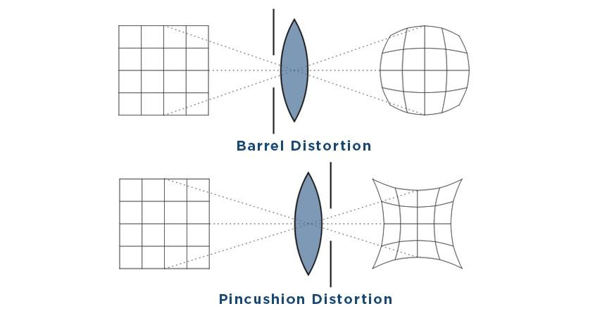

# Distorção

Até o momento, o modelo de Pinhole era perfeito, porém vamos adicionar uma lente à câmera e, na vida real, a lente deforma a imagem.

Para obter um campo de visão maior (FoV), adicionamos uma lente à câmera. Essa lente altera a propagação da luz:
1) A forma da lente muda o caminho da luz
2) A lente pode não estar perfeitamente paralela ao sensor

No modelo pinhole ideal, linhas retas continuam retas.
Mas na prática, a lente faz linhas retas virarem curvas, principalmente nas bordas da imagem.

Como as lentes são geralmente simétricas, a distorção costuma ser radial, com dois tipos:

- Barrel (barril): imagem “estufa” para fora
- Pincushion (almofada): imagem “aperta” para dentro

Além disso, existe a distorção tangencial, causada por desalinhamento entre lente e sensor.

### Modelos matemáticos

Para um ponto no plano normalizado $(x, y)$, com:

$$
r^2 = x^2 + y^2
$$

**Distorção radial**

$$
x_d = x \left(1 + k_1 r^2 + k_2 r^4 + k_3 r^6 \right)
$$

$$
y_d = y \left(1 + k_1 r^2 + k_2 r^4 + k_3 r^6 \right)
$$

**Distorção tangencial**

$$
x_d = x + 2 p_1 x y + p_2 (r^2 + 2x^2)
$$

$$
y_d = y + p_1 (r^2 + 2y^2) + 2 p_2 x y
$$

**Modelo completo (5 parâmetros)**

$$
x_d = x \left(1 + k_1 r^2 + k_2 r^4 + k_3 r^6 \right) + 2 p_1 x y + p_2 (r^2 + 2x^2)
$$

$$
y_d = y \left(1 + k_1 r^2 + k_2 r^4 + k_3 r^6 \right) + p_1 (r^2 + 2y^2) + 2 p_2 x y
$$

A partir do modelo comleto, podemos assumir que a imagem já foi corrigida (sem distorção)

### Formação de imagem em uma câmera monocular

Agora vamos resumir o processo de formação de imagem em uma câmera monocular:

1) Existe um ponto $P$ no mundo, com coordenadas $P_w$.

2) A câmera pode estar se movendo, então usamos $R, t$ (ou $T \in SE(3)$) para transformar o ponto para o sistema da câmera:

$$
P_c = R P_w + t
$$

3) O ponto $P_c = [X, Y, Z]^T$ é projetado no plano normalizado $Z = 1$:

$$
P_n =
\begin{bmatrix}
\frac{X}{Z} \\
\frac{Y}{Z} \\
1
\end{bmatrix}
$$

(Se $Z < 0$, o ponto está atrás da câmera, então não aparece)

4) Se houver distorção, aplicamos os modelos de distorção.

5) Por fim, aplicamos os intrínsecos:

$$
P_{uv} = K P_n
$$