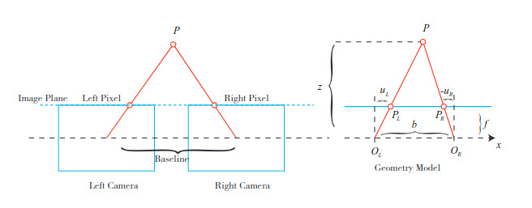

# Câmeras Estéreo

O modelo pinhole descreve uma câmera única. Porém, não conseguimos determinar a posição exata de um ponto 3D a partir de um único pixel.
Isso ocorre porque todos os pontos ao longo da reta que sai do centro óptico e passa pelo pixel geram o mesmo pixel (perda de profundidade).

Só conseguimos saber a posição real quando conhecemos a profundidade (ex: usando câmera estéreo ou RGB-D).

Para medir profundidade, podemos usar o mesmo princípio dos olhos humanos:

- cada olho vê a cena de um ângulo diferente, o que gera paralaxe

Câmeras estéreo fazem o mesmo.
Uma câmera estéreo tem:
- câmera esquerda
- câmera direita
- distância entre elas = baseline (b)

Desse modo, um ponto $P$ projeta em:

- $u_L$ na imagem esquerda  
- $u_R$ na imagem direita  

OBS: $u_L$ e $u_R$ são as coordenadas de pixel do mesmo ponto ao longo do eixo x. 

A diferença:

$$
d = u_L - u_R
$$

Isso é a **disparidade (parallax)**.

Sendo assim: 

### Fórmula da profundidade
Por semelhança de triângulos, temos:

$$
z = \frac{f \cdot b}{d}
$$

OBS: Apenas com pelo menos duas câmeras é possível descobrir a profundidade. 

# Câmeras RGB-D
Diferente da câmera estéreo (que calcula profundidade indiretamente), a RGB-D mede a profundidade de forma ativa, isto é, ela mede a distância de cada pixel diretamente.

Existem dois tipos principais:

1) Luz estruturada (Structured Light)
    - Emite um padrão infravermelho
    - Observa como esse padrão deforma no objeto
    - Ex: Kinect 1, RealSense antigos
2) Time of Flight (ToF)
    - Emite um pulso de luz
    - Mede o tempo que a luz leva para voltar
    - Ex: Kinect 2, sensores modernos

**Como essas câmeras fazem isso?**
A câmera RGB-D emite luz (geralmente infravermelho), recebe o retorno e calcula a distância.

Depois disso:
- associa cada pixel de cor com um valor de profundidade
- gera uma imagem RGB + mapa de profundidade
- pode reconstruir um ponto 3D → gerar nuvem de pontos

Dessa forma, para cada pixel, temos 
$(u, v)$ + profundidade $Z$