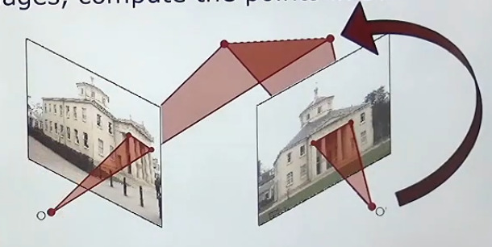

# Triangulação
Triangulação é uma técnica usada para descobrir a posição 3D de um ponto no espaço a partir de múltiplas observações 2D feitas por câmeras diferentes.
A ideia principal vem da geometria, pois se duas câmeras enxergam o mesmo ponto do mundo sob ângulos diferentes, é possível estimar onde esse ponto realmente está no espaço tridimensional.

OBS: É a mesma ideia da câmeras com duas "câmeras" que conseguem captar onde determinado ponto está no espaço (Stereo Vision). 

---

O nome “triangulação” vem justamente da formação de triângulos geométricos entre:
- câmera 1
- câmera 2
- ponto observado

---



O ponto em questão é o encontro das linhas, isto é, a intersecção.

### Primeira forma: 
Isso é possível, pois com a calibração da câmera e a estimativa da pose dela, teremos tanto o vetor orientação quanto o ponto que representa o centro óptico dela, e, com isso, temos uma reta (ponto + vetor).  
Porém, no mundo 3D pode ocorrer de duas linhas nunca se cruzarem, por exemplo, uma passa por cima e outra por baixo, dando a impressão em 2D que se cruzaram, mas na verdade não se cruzaram. 
**O que fazer nesse caso?**
Encontra a menor distância entre as duas retas e escolhe o ponto médio, de modo que estaremos considerando aquele ponto de interseção (nesse caso, é uma estimativa da posição do objeto analisado em questão). 

**ATENÇÃO:** Puramente os conceitos de GA ou Algelin para distância entre ponto e reta e entre duas retas.

Essa foi a maneira mais simples de encontrar o ponto. 

### Segunda forma:
Configuração especial para uma câmera estéreo. 
Ambas as câmeras apontam para a mesma direção e têm apenas um deslocamento na coordenada x (olhar aula 04_cameras_estereo.md)

## Orientação absoluta
Ao realizar a triangulação, obtemos a posição 3D de um ponto de forma relativa ao sistema de coordenadas das câmeras utilizadas. Isso significa que conhecemos a posição do ponto em relação às câmeras, mas ainda não sua posição absoluta em um referencial global do mundo real.
Em outras palavras, a triangulação reconstrói a geometria da cena localmente, porém o sistema reconstruído ainda pode estar:
- transladado,
- rotacionado,
- escalado

em relação ao mundo real.

Para converter essa reconstrução relativa em uma orientação e posicionamento absolutos, é necessário alinhar o sistema reconstruído com um referencial externo conhecido. **Esse processo é chamado de orientação absoluta.**
Para isso, utilizam-se pontos de controle, isto é, pontos cuja posição real no sistema global é conhecida previamente. A partir da correspondência entre:
- os pontos reconstruídos pela triangulação
- e suas posições reais conhecidas

torna-se possível calcular a transformação que leva o sistema relativo para o sistema absoluto.

Essa transformação normalmente envolve:
- rotação,
- translação,
- escala.

Em visão computacional e fotogrametria, algoritmos como o **DLT (Direct Linear Transformation), P3P ou RRS (Spatial Resectioning)** são frequentemente utilizados nesse processo. O DLT transforma o problema geométrico em um sistema linear de equações, permitindo estimar a transformação entre os pontos reconstruídos e os pontos do referencial global.
De forma geral, o processo funciona assim:

1) As câmeras observam a cena e realizam a triangulação dos pontos.
2) Obtém-se uma reconstrução 3D relativa.
3) Selecionam-se pontos de controle com coordenadas globais conhecidas.
4) Algoritmos como DLT estimam a transformação entre o sistema relativo e o sistema absoluto.
5) Toda a reconstrução passa então a estar alinhada ao sistema global do mundo real.

**ATENÇÃO:**
Para que essa transformação seja possível, normalmente são necessários pelo menos três pontos de controle não colineares, já que eles permitem determinar adequadamente a rotação e a translação no espaço tridimensional.

## Código
```python
import numpy as np
import cv2 as cv

# =========================
# Pontos 2D vistos pelas câmeras
# =========================

# Mesmo ponto observado pela câmera 1
pts_cam1 = np.array([
    [320, 240]
], dtype=np.float32)

# Mesmo ponto observado pela câmera 2
pts_cam2 = np.array([
    [300, 240]
], dtype=np.float32)

# Formato esperado:
# lista contendo os pontos de cada câmera
points2d = [
    pts_cam1.T,
    pts_cam2.T
]

# =========================
# Matrizes de projeção
# =========================

# Matriz intrínseca da câmera
K = np.array([
    [500,   0, 320],
    [  0, 500, 240],
    [  0,   0,   1]
], dtype=np.float64)

# -------------------------
# Câmera 1
# -------------------------

R1 = np.eye(3)
t1 = np.array([[0], [0], [0]])

P1 = K @ np.hstack((R1, t1))

# -------------------------
# Câmera 2
# -------------------------

R2 = np.eye(3)

# câmera deslocada 0.2m no eixo X
t2 = np.array([[-0.2], [0], [0]])

P2 = K @ np.hstack((R2, t2))

projection_matrices = [P1, P2]

# =========================
# Triangulação
# =========================

points3d = cv.sfm.triangulatePoints(
    points2d,
    projection_matrices
)

# =========================
# Resultado
# =========================

print("Ponto 3D reconstruído:")
print(points3d)
```

**ATENÇÃO: A função cv.sfm.triangulatePoints depende da extensão sfm, mas o opencv deixa uma como cv.triangulatePoints(P1, P2, pts_cam1.T, pts_cam2.T)**


#### Fonte:
Assistir o vídeo: https://www.youtube.com/watch?v=UZlRhEUWSas&list=PLgnQpQtFTOGTPQhKBOGgjTgX-mzpsOGOX&index=26

Exemplo de calibração e triangulação de câmeras estéreo com OpenCV e Python: https://temugeb.github.io/opencv/python/2021/02/02/stereo-camera-calibration-and-triangulation.html
**OBS: Nesse link temos mais playlists sobre Fotogrametria**
