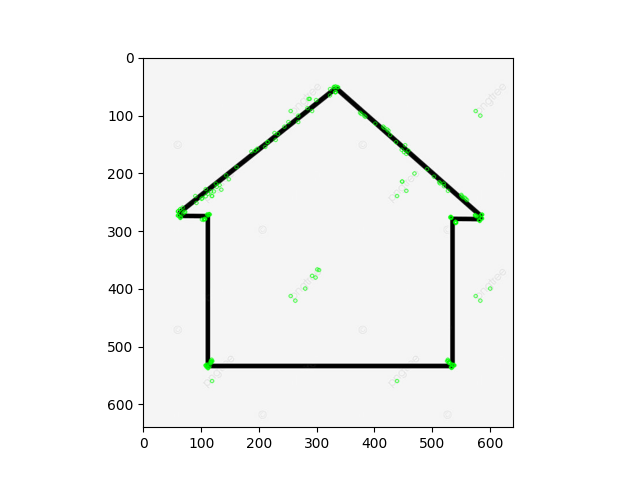

### 2 - We found that the ORB feature points provided by OpenCV are not evenly distributed in the image. Can you find or propose a way to make the distribution of feature points more evenly? Implement itin python.

#### Vamos entender primeiro o problema em questão:
Quando usamos os detectores, como o ORB, a ideia do algoritmo é procurar regiões na imagem que tenham alto contraste, mudanças bruscas de intensidade, texturas ou cantos, que são as regiões importantes (as features). 
Contudo, se tivermos regiões muito homogêneas, como paredes lisas, céu aberto, chão uniforme, no geral, superfícies sem alguma textura que seja possível captar as features, normalmente não possuem a informação suficiente para gerar os keypoints. 
Dessa forma, surge o problema de que o ORB, por exemplo, não tenta distribuir os pontos uniformemente pela imagem, o que acontece, na realidade, é que ele simplesmente detecta os pontos com maior contraste, e isso faz com que muitos keypoints acabem concentrados em regiões muito detalhada da imagem, enquanto outras regiões ficam praticamente vazias. 

**Exemplo:**

Nessa imagem, vemos que o interior do contorno nem tem pontos direito, e os que tem são por conta de escritos que a imagem possui. 
OBS: Talvez esse não seja o melhor exemplo, até porque não tem nada dentro do contorno.
Dessa forma, a distribuição espacia fica desbalanceada, pois, ao invés de os pontos ocuparem toda a imagem de forma homogênea, eles ficam aglomerados em algumas regiões específicas. 

**OK, mas qual é o problema disso?**
No matching de imagens, podemos acabar tendo correspondências apenas em partes que os keypoints estão aglomerados. 

Outros problemas pesquisados:
- Na estimação de homografia, se os pontos estiverem concentrados em apenas uma região, a matriz estimada pode ficar instável ou incorreta, porque faltam restrições geométricas em outras áreas da imagem.
- Em SLAM e Visual Odometry, uma distribuição ruim de features pode causar perda de rastreamento, deriva acumulada e dificuldade em estimar corretamente o movimento da câmera.
- Na estimação de pose (PnP), pontos muito concentrados podem gerar problemas numéricos e diminuir a precisão da pose estimada.
- Outro problema importante é redundância de informação. Se muitos keypoints estão muito próximos uns dos outros, eles acabam descrevendo praticamente a mesma região da imagem. Ou seja, você gasta processamento com pontos redundantes em vez de capturar informação distribuída pela cena inteira.

**Solução encontrada**
A solução considerada clássica, é dividir a imagem em um grid, então é como se a imagem grande fosse partida como peças de um quebra cabeça. Cada peça terá seus próprios keypoints e, com isso, podemos também limitar a quantidade de pontos por célula. 
Sendo assim, ao final, deveremos ter keypoints mais espalhados. 